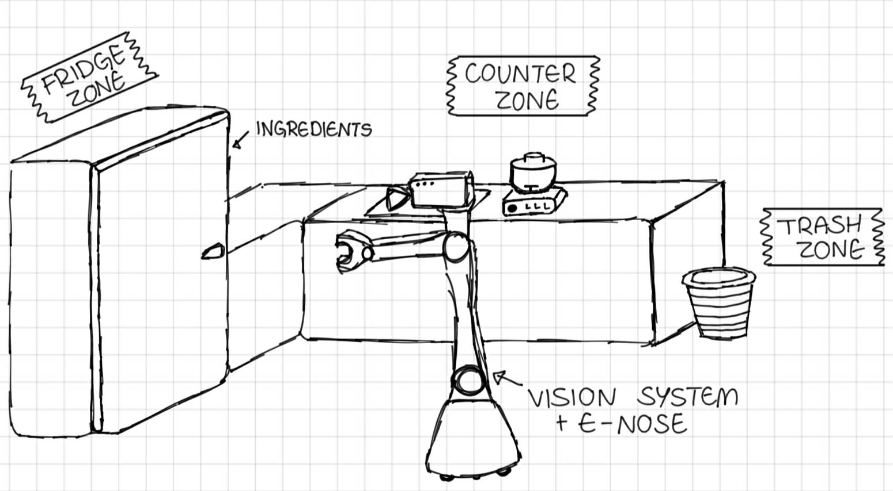

# Assignment D2-V9: Domestic Service Robot - Sensing and Inspection Requirments.
Given assignment is a project from the "AI in Robotics 2" course at the University of Genoa. The project involves creating an action plan in PDDL and PDDL+.

# Overview
This project models kitchen area that contains three main zones:
* fridge zone,
* trash zone,
* counter zone.

Autonomous one-hand robot was created to work as a kitchen assistant. His main objective is preparing a smoothie. To do so, it needs to find one fresh fruit, one fresh liquid and place it inside a blender bowl. The robot is equipped with a vision system and an eNose. He is capable of inspecting fruits to detect mold and sniff a liquid to detect spoilage.

# Q1 - PDDL

## Domain
The domain logic for Q1 is implemented using Classical PDDL with action costs. It focuses on the symbolic, discrete state transitions required for the kitchen robot to successfully execute its tasks, while laying the foundational logic for future PDDL+.

### Predicates
* `(robot-at ?r - robot ?l - location)` – Tracks the localized position of the robot in the kitchen.
* `(ingredient-at ?i - ingredient ?l - location)` – Represents ingredient placement.
* `(holding ?r - robot ?i - ingredient)` – Indicates which item is currently in robot's hand. 
* `(hand-empty ?r - robot)` – Indicates whether robot's hand is occupied.
* `(fridge-open)` – Controls the global state of the fridge door (logic for future PDDL+).
* `(in-bowl ?i - ingredient)` – Identifies ingredients that have been successfully placed in the blender bowl.
* `(inspected ?i - ingredient)` – Marks whether an ingredient has undergone an inspection.
* `(is-fresh ?i - ingredient)` – Represents freshness status of an ingredient.
* `(smoothie-prepared ?m - meal)` – The main objective state.
* Spatial categorizers: `(fridge-zone ?l)`, `(counter-zone ?l)`, `(trash-zone ?l)` used to strictly map abstract actions to geometric realities.

### Numeric function
* `(total-cost)` – A global scalar accumulated with every executed action. Used to optimize robot actions.

### Actions

1. `move` (Cost: 5): Navigates the robot between kitchen zones.
2. `open-fridge` / `close-fridge` (Cost: 2): Changes fridge state. Requires a free manipulator.
3. `take-ingredient` (Cost: 1): Grabs an item from a specific location. Requires the fridge door to be open if the ingredient resides in the fridge zone, and a free manipulator.
4. `scan-mold` (Cost: 3) / `smell-spoil` (Cost: 4): Specialized sensing actions. They are heavily constrained by types: `scan-mold` can only be performed on a `fruit` object using the vision system, while `smell-spoil` can only target a `liquid` object using the eNose. Both actions require the robot to actively hold the item.
5. `put-in-bowl` (Cost: 1): Transfers a fresh and inspected ingredient into the blender.
6. `throw-away` (Cost: 1): If the inspection reveals that the food is not fresh, this action allows the robot to drop the unfresh ingredient into the trash.
7. `blend-smoothie` (Cost: 10): The final action. It can only execute if the fridge is fully closed and fresh fruit and fresh milk are inside the bowl.

## Problems and plans

To analyze how the robot handles initial knowledge, sensing constraints, and failure recovery, three test scenarios were created:

* `problem_known_state`: Simulates a fully calibrated, deterministic environment. Both `banana` and `milk` are predefined as `is-fresh` and `inspected`. In this example it is seen that robot skips every inspecting action.
* `problem_unknown_state`: Introduces a true task-planning challenge. Ingredients are placed inside the fridge, but they lack the `(inspected)` predicate. The fridge contains a fresh `banana`, fresh `milk`, and an uninspected `strawberry`. Crucially, the `strawberry` is intentionally left out of the `is-fresh` initialization list, meaning it is implicitly rotten due to the Closed World Assumption (CWA).
* `problem_unknown_state_forced`: Uses the same initial state as the unknown scenario but adds a hard constraint to the `(:goal)` state: ` (ingredient-at strawberry trash)`. This forces the planner to explicitly handle and recover from a food contamination event rather than simply choosing an optimal alternative.

### Known state problem output

(move WallE counter fridge)  
(open-fridge WallE fridge)  
(take-ingredient WallE milk fridge)  
(move WallE fridge counter)  
(put-in-bowl WallE milk counter) 
(move WallE counter fridge) 
(take-ingredient WallE banana fridge) 
(move WallE fridge counter) 
(put-in-bowl WallE banana counter) 
(move WallE counter fridge) 
(close-fridge WallE fridge) 
(move WallE fridge counter) 
(blend-smoothie WallE counter banana_smoothie banana milk) 

### Unknown state problem output - inspecting rotten food not forced

(move WallE counter fridge) 
(open-fridge WallE fridge) 
(take-ingredient WallE milk fridge) 
(smell-spoil WallE milk) 
(move WallE fridge counter) 
(put-in-bowl WallE milk counter) 
(move WallE counter fridge) 
(take-ingredient WallE banana fridge) 
(scan-mold WallE banana) 
(move WallE fridge counter) 
(put-in-bowl WallE banana counter) 
(move WallE counter fridge) 
(close-fridge WallE fridge) 
(move WallE fridge counter) 
(blend-smoothie WallE counter fruit_smoothie banana milk) 

### Unknown state problem output - inspecting rotten food forced

(move WallE counter fridge) 
(open-fridge WallE fridge) 
(take-ingredient WallE strawberry fridge) 
(move WallE fridge trash) 
(scan-mold WallE strawberry) 
(throw-away WallE trash strawberry) 
(move WallE trash fridge) 
(take-ingredient WallE milk fridge) 
(smell-spoil WallE milk) 
(move WallE fridge counter) 
(put-in-bowl WallE milk counter) 
(move WallE counter fridge) 
(take-ingredient WallE banana fridge) 
(scan-mold WallE banana) 
(move WallE fridge counter) 
(put-in-bowl WallE banana counter) 
(move WallE counter fridge) 
(close-fridge WallE fridge) 
(move WallE fridge counter) 
(blend-smoothie WallE counter fruit_smoothie banana milk) 

## Discussion
This section evaluates the Q1 Basic PDDL model based on the generated plans for the three scenarios (Known State, Unknown State - Not Forced, and Unknown State - Forced). It analyzes how the model handles uncertainty and addresses the project's guidelines.

### 1. Adherence to Modelling Guidelines

The generated plans prove that the domain successfully fulfills all three assignment guidelines:
* Explicit Inspection Actions: The sensing actions (`smell-spoil` and `scan-mold`) are modeled as separate operators with their own costs. They must be executed before the robot can use any ingredient.
* Approximating Partial Knowledge: By separating the objective reality (`is-fresh`) from the robot's knowledge (`inspected`), I simulated an unknown environment. The robot remains "blind" to the freshness of the ingredients until it scans them.
* Inspection Affecting Planning Decisions: This is clearly visible in the Forced Unknown State plan. When the robot inspects the rotten strawberry, it detects the defect and changes its strategy from meal preparation to a transit and execution of the `throw-away` action.

### 2. Limitations of Classical PDDL for Uncertainty

While the Q1 model successfully forces a safe sequence of actions, the experiment highlights major limitations of classical PDDL when dealing with uncertainty:

1.  The All-Knowing Planner Paradox: In classical PDDL, the solver has full access to the problem file before generating the plan. The planner already "knows" the strawberry is rotten from the start. True online discovery is impossible; the robot merely simulates the process of gaining knowledge to satisfy pre-conditions.
2.  Deterministic Outcomes: Classical PDDL cannot model probabilistic sensing (e.g., a sensor with a 90% accuracy rate). The outcome of an inspection must be hardcoded and 100% predictable in the initial state.
3.  Static World (No Continuous Time): In Plans 2 and 3, the robot opens the fridge at the beginning, leaves it open (`fridge-open`) while moving to the counter to pour milk, and closes it only at the very end. In classical PDDL, time does not pass continuously, so keeping the fridge open has no negative consequences. This is highly unrealistic for a domestic environment.

For these reasons it seems convinient to switch from classical PDDL to PDDL+ to introduce continuous processes and instantaneous event. It will allow to implement real environment dynamics.

# Q2

## Domain

In contrast to the classical model (Q1), Q2 PDDL+ model introduces environmental dynamics, where the state of ingredients changes independently of the robot's actions. 
The initial design intended to introduce fridge cooling and fridge warming processes to simulate temperature-dependent spoilage. However, due to the high computational complexity of differential equations, which exceeded planner's calculation capacity, the model was simplified to easy linear degradation process. Ingredients expire at constant brates based on whether they are stored in the fridge or are outside.

### Predicates
In addition to the Q1 predicates, the PDDL+ model uses flags to manage processes.

* `moving-now ?r - robot ?l - location`
* `moving-now ?r - robot ?l - location`
* `opening-fridge-now ?r - robot`
* `closing-fridge-now ?r - robot`
* `taking-now ?r - robot ?i - ingredient`
* `putting-down-now ?r - robot`
* `scanning-now ?r - robot ?i - ingredient`
* `smelling-now ?r - robot ?i - ingredient`
* `putting-in-bowl-now ?r - robot ?i - ingredient`
* `throwing-away-now ?r - robot ?i - ingredient`
* `blending-now ?r - robot ?m - meal`
* `busy ?r - robot`

### Handling durative-actions
As ENHSP planner does not support durative-action, it was necessary to divide every task into three components: Action, Process and Event. Flags mentioned in previous subsection are used to signal to the robot whether certain processes are still working.

* Action - initiates the process flag and resets a timer that calculates how long should this action take.
* Process - increments the timer over time.
* Event - triggers automatically when the timer meets deadline. Every event finalizes the action and clears busy flag.

### Numeric function
* `spoilage-level ?i - ingredient` - tracks the continuous degradation of and ingredient
* `action-timer ?r - robot` - measures the elapsed time of a current task.
* `total-cost` - metric that helps planner to find well-optimized plan.

### Important processes and events
These are the most important processes in this project. They calculate how fast food loses its freshness and when it finally spoils.
* Processes  `spoilage-fridge` and `spoilage-outside` - These processes run continuosly in the background, increasing the spoilage-lebel of each ingredient based on its location. They simulate environment, showing that food loses its freshness at a higher rate when stored outside the fridge compared to inside.
* Event `food-spoils` - This event tracks the spoilage-level of all ingredients. Once the value exceeds the predifined limit of 10.0, the event triggers automatically to assign `not (is-fresh)`  and `not (inspected)` predicate to spoiled ingredient. This change forces the agent to identify the ingredient as expired.

## Problems and plans

To analyze how the robot manages environmental dynamics, continuous degradation processes, and the necessity of real-time sensing, three test scenarios were created:

* `problem_fully_fresh` : This scenario is a baseline that simulates and ideal environment where ingredients are initialized with a spoilage-level equal to 0. It demonstrated the robot's ability to execute its task without any immediate risks of spoilage.
* `problem_partly_fresh` : This scenario introduces a subtle initial difference in degradation levels, with the apple initialized at 2.0 and the milk at 0.0. This challenges the planner to acknowledge different "lifespans" among ingredients. It demonstrates the robot’s ability to determine an optimal task sequence that ensures time-sensitive items are processed before they reach the critical spoilage threshold.
* `problem_almost_rotten` : This is the most complex scenario. It introduces two apples with significantly different degradation levels (8.0 and 2.0). By setting the objective to inspect all ingredients, the robot is forced to prioritize its tasks based on their spoilage-level, which demonstrates the procedure for handling and discarding spoiled food. However, it is important to note that demonstrating a "failure" through replanning is difficult because the planner actively seeks the most efficient path. It avoids at all costs choosing an order that would result in spoilage, as this would increase the total-cost. Consequently, the plan serves as proof of the planner's correctness; it integrates environmental dynamics into its decision-making to preemptively avoid degradation. 

### Fully fresh ingredients problem output

Found Plan: 
0: -----waiting---- [2.0]  
2.0: (move WallE counter fridge) 
2.0: -----waiting---- [7.0] 
7.0: (open-fridge WallE fridge) 
7.0: -----waiting---- [9.0] 
9.0: (take WallE milk fridge) 
9.0: -----waiting---- [10.0] 
10.0: (smell-spoil WallE milk) 
10.0: -----waiting---- [14.0] 
14.0: (move WallE fridge counter) 
14.0: -----waiting---- [19.0] 
19.0: (put-in-bowl WallE milk counter) 
19.0: -----waiting---- [20.0] 
20.0: (move WallE counter fridge) 
20.0: -----waiting---- [25.0] 
25.0: (take WallE apple fridge) 
25.0: -----waiting---- [26.0] 
26.0: (scan-mold WallE apple) 
26.0: -----waiting---- [29.0] 
29.0: (move WallE fridge counter) 
29.0: -----waiting---- [34.0] 
34.0: (put-in-bowl WallE apple counter) 
34.0: -----waiting---- [35.0] 
35.0: (move WallE counter fridge) 
35.0: -----waiting---- [40.0] 
40.0: (close-fridge WallE fridge) 
40.0: -----waiting---- [42.0] 
42.0: (move WallE fridge counter) 
42.0: -----waiting---- [47.0] 
47.0: (blend WallE counter apple-smoothie apple milk) 
47.0: -----waiting---- [57.0] 

### Partly fresh ingredients problem output

Found Plan: 
0: (move WallE counter fridge) 
0: -----waiting---- [5.0] 
5.0: (open-fridge WallE fridge) 
5.0: -----waiting---- [7.0] 
7.0: (take WallE apple fridge) 
7.0: -----waiting---- [8.0] 
8.0: (scan-mold WallE apple) 
8.0: -----waiting---- [11.0] 
11.0: (move WallE fridge counter) 
11.0: -----waiting---- [16.0] 
16.0: (put-in-bowl WallE apple counter) 
16.0: -----waiting---- [17.0] 
17.0: (move WallE counter fridge) 
17.0: -----waiting---- [22.0] 
22.0: (take WallE milk fridge) 
22.0: -----waiting---- [23.0] 
23.0: (smell-spoil WallE milk) 
23.0: -----waiting---- [27.0] 
27.0: (move WallE fridge counter) 
27.0: -----waiting---- [32.0] 
32.0: (put-in-bowl WallE milk counter) 
32.0: -----waiting---- [33.0] 
33.0: (move WallE counter fridge) 
33.0: -----waiting---- [38.0] 
38.0: (close-fridge WallE fridge) 
38.0: -----waiting---- [40.0] 
40.0: (move WallE fridge counter) 
40.0: -----waiting---- [45.0] 
45.0: (blend WallE counter apple-smoothie apple milk) 
45.0: -----waiting---- [55.0] 

### Almost rotten ingredient problem output

Found Plan: 
0: (move WallE counter fridge) 
0: -----waiting---- [5.0] 
5.0: (open-fridge WallE fridge) 
5.0: -----waiting---- [7.0] 
7.0: (take WallE apple1 fridge) 
7.0: -----waiting---- [8.0] 
8.0: (scan-mold WallE apple1) 
8.0: -----waiting---- [11.0] 
11.0: (move WallE fridge counter) 
11.0: -----waiting---- [16.0] 
16.0: (put-in-bowl WallE apple1 counter) 
16.0: -----waiting---- [17.0] 
17.0: (move WallE counter fridge) 
17.0: -----waiting---- [22.0] 
22.0: (take WallE milk fridge) 
22.0: -----waiting---- [23.0] 
23.0: (smell-spoil WallE milk) 
23.0: -----waiting---- [27.0] 
27.0: (move WallE fridge counter) 
27.0: -----waiting---- [32.0] 
32.0: (put-in-bowl WallE milk counter) 
32.0: -----waiting---- [33.0] 
33.0: (move WallE counter fridge) 
33.0: -----waiting---- [38.0] 
38.0: (take WallE apple2 fridge) 
38.0: -----waiting---- [39.0] 
39.0: (scan-mold WallE apple2) 
39.0: -----waiting---- [42.0] 
42.0: (move WallE fridge trash) 
42.0: -----waiting---- [47.0] 
47.0: (throw-away WallE trash apple2) 
47.0: -----waiting---- [48.0] 
48.0: (move WallE trash fridge) 
48.0: -----waiting---- [53.0] 
53.0: (close-fridge WallE fridge) 
53.0: -----waiting---- [55.0] 
55.0: (move WallE fridge counter) 
55.0: -----waiting---- [60.0] 
60.0: (blend WallE counter apple-smoothie apple1 milk) 
60.0: -----waiting---- [70.0] 

## Discussion

### Interaction between sensing and dynamics
In the PDDL+ model, the relationship between sensing and dynamics is essential for a robot working in a real-world environment. Unlike classical PDDL, where the environment stays the same, PDDL+ allows the environment to change on its own, which makes sensing a vital part of the robot's work.

* The spoilage processes happen in the background, whether the robot is working or not. Because the robot does not know the exact spoilage-level of the food, it must use sensing actions (like scan-mold or smell-spoil) to check the state of the ingredients. These actions act as a "synchronization point"—they allow the robot to update its knowledge and decide whether to use an ingredient or throw it away.

* The plans show that the robot doesn't just react to problems, it uses knowladge of how things change to avoid them. The robot is intelligent because it includes risk of spoilage in its planning. As we can see in the 3rd plan, the robot decided to process the fresher apple first, then discard the second one that would be rotten at the end of the task sequence. This shows that the robot understand that time is limited and that it must balance its actions to keep the total-cost as low as possible.

### Limitations of deterministic planning
A major limitation in both models is that PDDL solvers are deterministic. This means the planner has "God-like" knowledge of the environment from the very start, including the exact spoilage-level and freshness of every item. Even though the robot must perform inspection actions to follow the rules, the planner already knows the results before the robot even moves. In a real-world situation, this information would be hidden from the robot until it actually inspects the food. Our current model simulates the need for sensing by making inspection a required step, using this "discovery" pattern to mimic real-world partial knowledge within a system that technically knows everything from the beginning.

# How to run the project
You can run the project using an online PDDL planner or the PDDL VSCode extension with the ENHSP solver (installation instructions are available in Mr. Kashmar’s repository).

* For Q1: A basic BFWS solver is sufficient.
* For Q2: You must use ENHSP.

To run the models through VSCode, open your terminal in the project folder and use the following command:

`java -jar ~/enhsp/ENHSP-Public/enhsp-dist/enhsp.jar -o domain.pddl -f PROBLEM_NAME.pddl`

Replace PROBLEM_NAME.pddl with the name of the specific problem file you want to execute.

# Assignment content

## Scenario
The robot must prepare a meal, but the state of some ingredients is unknown
(e.g., whether milk is fresh or spoiled). The robot must inspect ingredients
before use.
Inspection actions reveal the state of an object.

## Modelling Guidelines
<ul>
  <li>Represent inspection explicitly as an action.</li>
  <li>Avoid assuming full knowledge of the environment.</li>
  <li>Ensure that inspection affects planning decisions</li>
</ul>

## Q1 - Basic PDDL Model
It is mandatory to 
<ul>
  <li> Approximate sensing using explicit predicates </li>
  <li> Provide: one problem with known states, one requiring inspection predicates </li>
  <li> Provide: valid plans </li>
</ul>

## Q2 - PDDL+ Model
It is mandatory to
<ul>
  <li> Introduce a process modelling ingredient degradation over time. </li>
  <li> Introduce an event representing state change (e.g. spoilage)</li>
  <li> Show how sensing interacts with dynamic changes </li>
</ul>

## Discussion
Discuss given aspects:
<ul>
  <li> limitations of classical PDDL for uncertainty </li>
  <li> interaction between sensing and dynamics </li>
</ul>
